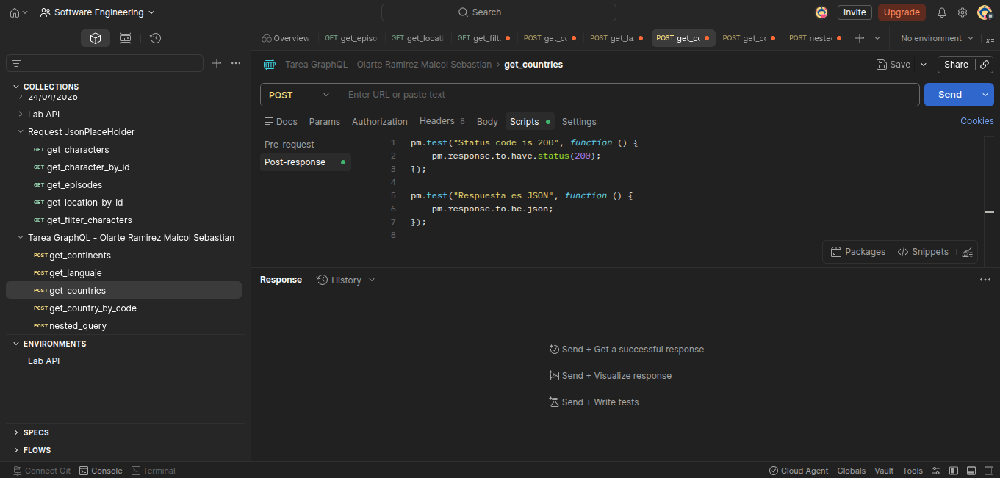
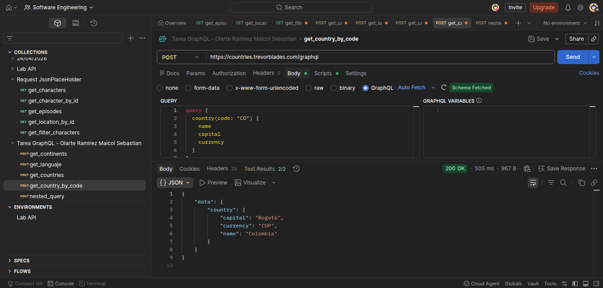
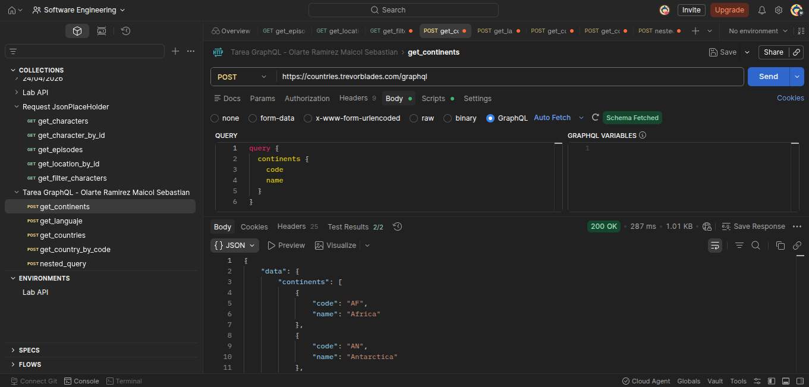
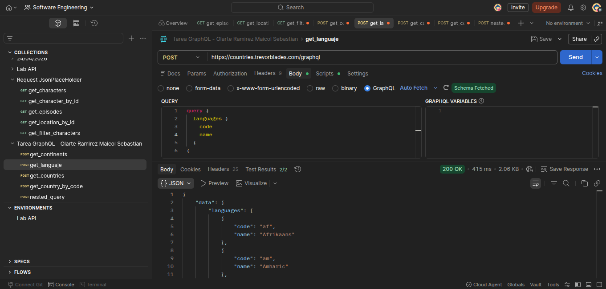
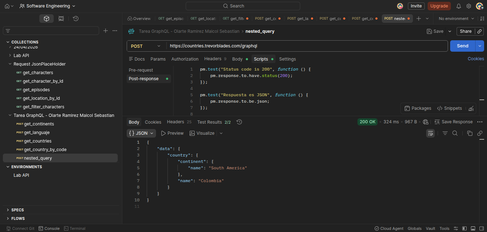

# API GraphQL - Maicol Sebastian Olarte Ramirez

## ¿Qué diferencia encontraste vs REST?

La principal diferencia es que en GraphQL puede solicitar exactamente los datos que necesita, mientras que en REST los datos ya tienen una estructura fija.

Por otro lado, GraphQL maneja un solo endpoint, mientras REST maneja varias direcciones, también GraphQL maneja  consultas anidadas , permitiendo obtener datos relacionados en una sola petición, por último en REST se obtiene mucha más información de la que se necesita.


## ¿Cuántos requests REST necesitarías para reemplazar tu query más compleja?

Por ejemplo en una consulta anidada como la de país mas continente, en GraphQL se hace en una sola petición en REST se necesitarían dos, una para el país y otra para el continente asociado.

## ¿En qué proyecto real usarías GraphQL?

La utilizaria en frontends complejos como por ejemplo dashboards o aplicaciones de react , o donde las aplicaciones necesitan optimizar el consumo de datos.

## Evidencias de peticiones

### Obtener todos los paises



Evidencia de la consulta que recupera el listado general de paises desde el endpoint GraphQL.

### Obtener un pais por identificador



Evidencia de la consulta individual de un pais usando su identificador como argumento.

### Obtener todos los continentes



Evidencia de la consulta que devuelve la informacion de los continentes disponibles.

### Obtener los idiomas registrados



Evidencia de la consulta enfocada en los idiomas disponibles dentro de la API.

### Consulta anidada de pais y continente



Evidencia de una consulta anidada donde se obtiene la informacion del pais junto con los datos de su continente relacionado.

## Algunos test implementados.

Para todas las consultas se implementaron los siguientes tests.

- Probar que la consulta fue exitosa.
- Probar que el resultados en un json.

```javascript
pm.test("Status code is 200", function () {
    pm.response.to.have.status(200);
});

pm.test("Respuesta es JSON", function () {
    pm.response.to.be.json;
});
