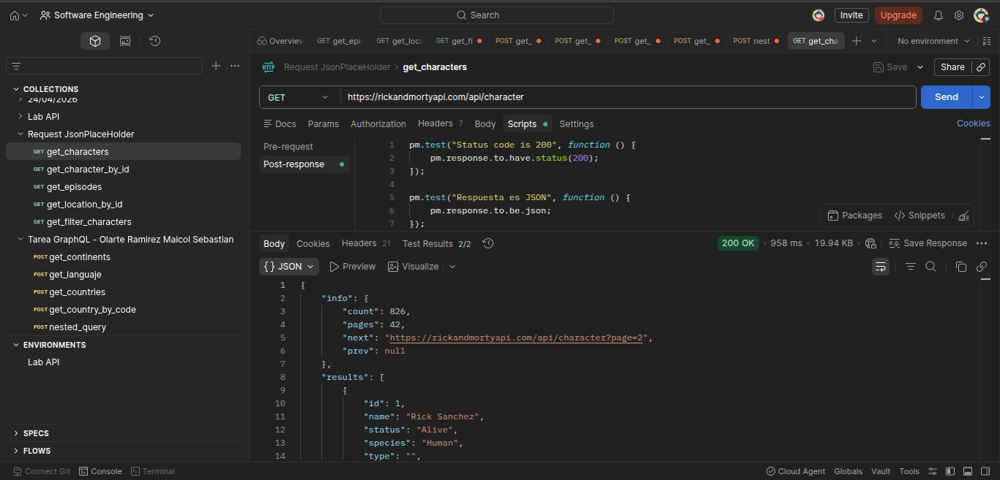
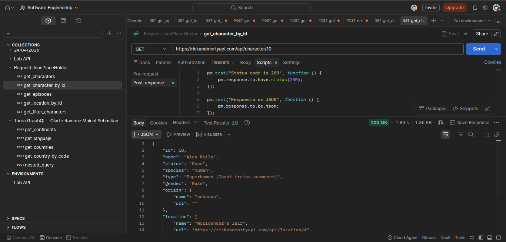
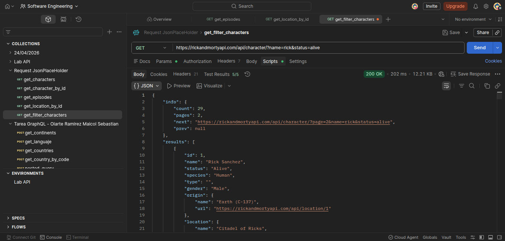
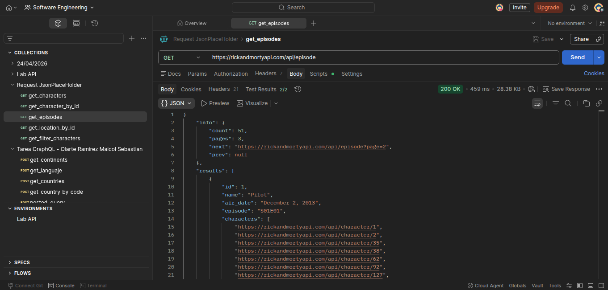
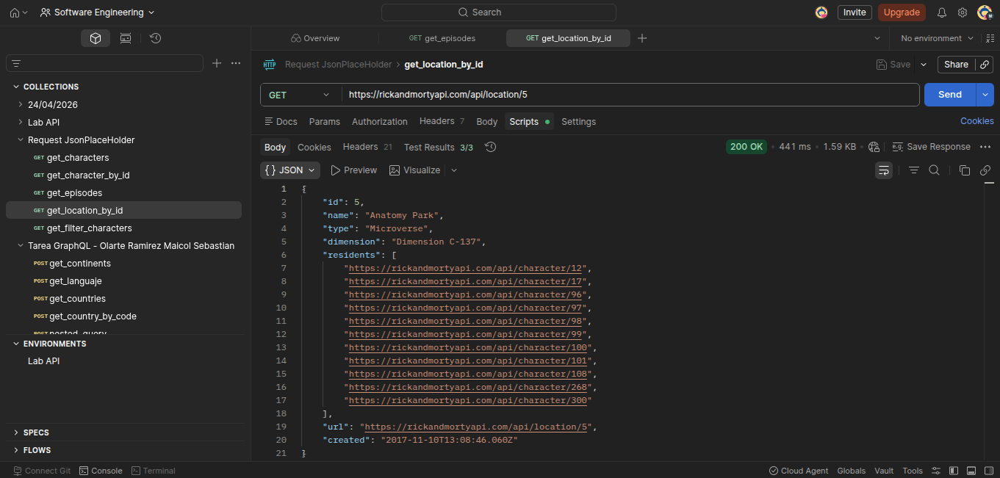

# API Rest - Maicol Sebastian Olarte Ramiez

## ¿Qué API elegiste y por qué?
Elegí Rick and Morty porque me parece interesante el tema y porque es sencilla de consumir y no requiere tokens ni registro para utilizarla.
## ¿Qué datos devuelve?
Devuelve información relacionada a un personaje , como lo es el id, nombre, estado, especie , tipo, género, origen, ubicación, episodio, url al endpoint y fecha de creación.

También información acerca de la ubicación como id, nombre, tipo, dimensión, residentes, url y fecha de creación en la DB.

Por último la información de cada episodio con id, nombre, fecha de salida al aire, personajes, url y el tiempo de creación.

## ¿Usa token o no? ¿Qué tipo?

Para el caso esta API es publica y no requiere autentificación o algun tipo de token.

## ¿Qué código de estado recibiste en cada request?

En todas las peticiones que realize obtuve un codigo 200 de petición exitosa.

## ¿Qué aprendiste diferente a JSONPlaceholder?

Aprendí la manera en como consultar un API , los diferentes tipos de tokens y como deben ir estos en los headers, así como tambien el uso de postman en cuanto a colecciones y entornos.

## Evidencias de cada petición

### Obtener lista de personajes



Evidencia de la peticion al endpoint de personajes para recuperar el listado general disponible en la API.

### Obtener personaje por identificador



Evidencia de la peticion que consulta un personaje especifico usando su identificador.

### Filtrar personajes



Evidencia de la peticion con parametros de filtro para limitar los personajes devueltos por la API.

### Obtener un episodio



Evidencia de la peticion al endpoint de episodios para consultar la informacion de un episodio puntual.

### Obtener una ubicacion por identificador



Evidencia de la peticion al endpoint de ubicaciones usando un identificador especifico.


## Algunos test implementados.

Para la consulta para filtrar personajes se aplicaron los siguientes tests.

- Probar que la consulta fue exitosa.
- Probar que el resultados en un json.
- Confirmar si hay resultados en el array.
- Validar que el filtro se este aplicando.
- Verificar que los resultados sean correctos y que traigan la información especificada mediante los filtros.

 
```javascript
pm.test("Status code is 200", function () {
    pm.response.to.have.status(200);
});

pm.test("Respuesta es JSON", function () {
    pm.response.to.be.json;
});

pm.test("Tiene resultados", function () {
    const jsonData = pm.response.json();
    pm.expect(jsonData.results.length).to.be.above(0);
});

pm.test("Todos los personajes contienen 'Rick'", function () {
    const jsonData = pm.response.json();
    jsonData.results.forEach(character => {
        pm.expect(character.name.toLowerCase()).to.include("rick");
    });
});

pm.test("Todos los personajes están vivos", function () {
    const jsonData = pm.response.json();
    jsonData.results.forEach(character => {
        pm.expect(character.status).to.eql("Alive");
    });
});
