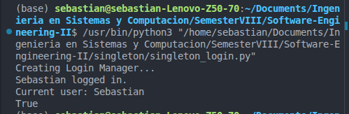
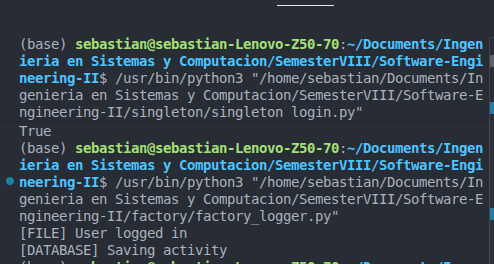
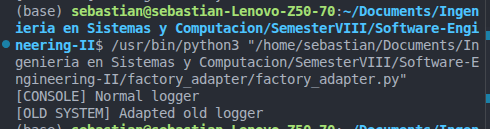
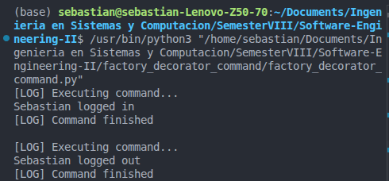

# Patrones de Diseño – Ingeniería de Software II

Este repositorio contiene implementaciones en Python de los patrones de diseño clásicos de la **Gang of Four (GoF)**, organizadas por combinación de patrones.

---

## Implementaciones

### 1. Singleton – `singleton/singleton_login.py`

**Patrón:** Singleton  
**Categoría:** Creacional

Garantiza que solo exista **una instancia** de `LoginManager` en toda la aplicación y proporciona un punto de acceso global a ella.

- Se sobreescribe `__new__` para interceptar la creación del objeto y devolver siempre la misma instancia.
- La primera llamada crea la instancia; las llamadas posteriores devuelven la instancia almacenada.
- `_instance` es una variable de clase que almacena la única instancia.

**Clases principales:**
| Clase | Rol |
|---|---|
| `LoginManager` | Clase singleton que gestiona el usuario actualmente autenticado |

---

### 2. Factory Method – `factory/factory_logger.py`

**Patrón:** Factory Method  
**Categoría:** Creacional

Define una interfaz (`LoggerFactory`) para crear un objeto logger, pero deja que las **subclases decidan qué clase instanciar**.

- `Logger` es el producto abstracto; `FileLogger` y `DatabaseLogger` son los productos concretos.
- `LoggerFactory` es el creador abstracto; `FileLoggerFactory` y `DatabaseLoggerFactory` son los creadores concretos.
- El código cliente trabaja contra la interfaz `Logger`, no contra clases concretas.

**Clases principales:**
| Clase | Rol |
|---|---|
| `Logger` | Producto abstracto (interfaz) |
| `FileLogger` / `DatabaseLogger` | Productos concretos |
| `LoggerFactory` | Creador abstracto |
| `FileLoggerFactory` / `DatabaseLoggerFactory` | Creadores concretos |

---

### 3. Factory + Adapter – `factory_adapter/factory_adapter.py`

**Patrones:** Factory + Adapter  
**Categoría:** Creacional + Estructural

Combina una **fábrica estática** que crea loggers con un **adaptador** que envuelve al `OldLogger` legado para que cumpla con la interfaz moderna `Logger`.

- `OldLogger` tiene un método incompatible (`old_write`); `LoggerAdapter` traduce las llamadas a `write_log` hacia `old_write`.
- `LoggerFactory.create_logger()` actúa como punto de entrada único que devuelve un logger nativo o uno adaptado, ocultando la incompatibilidad al cliente.

**Clases principales:**
| Clase | Rol |
|---|---|
| `Logger` | Interfaz destino |
| `OldLogger` | Clase legada incompatible |
| `LoggerAdapter` | Adaptador – hace que `OldLogger` cumpla con `Logger` |
| `ConsoleLogger` | Logger concreto nativo |
| `LoggerFactory` | Fábrica estática – crea el logger adecuado según el tipo |

---

### 4. Factory + Decorator + Command – `factory_decorator_command/factory_decorator_command.py`

**Patrones:** Factory + Decorator + Command  
**Categoría:** Creacional + Estructural + Comportamental

Combina tres patrones para construir un pipeline de ejecución de comandos flexible:

- **Command** – encapsula una solicitud (`LoginCommand`, `LogoutCommand`) como un objeto con un método `execute()`.
- **Decorator** – `CommandLogger` envuelve cualquier `Command` y agrega registro (logging) antes y después de la ejecución sin modificar el comando original.
- **Factory** – `CommandFactory.create_command()` crea el comando correcto y **automáticamente lo envuelve** con el decorador antes de devolverlo.

**Clases principales:**
| Clase | Rol |
|---|---|
| `LoginSystem` | Receptor – ejecuta las acciones reales de login/logout |
| `Command` | Interfaz abstracta de comando |
| `LoginCommand` / `LogoutCommand` | Comandos concretos |
| `CommandLogger` | Decorador – agrega logging alrededor de cualquier comando |
| `CommandFactory` | Fábrica – crea y decora comandos en un solo paso |

