# Ingeniería de Software II

### Maicol Sebastian Olarte Ramirez

---

## 📌 Descripción

Laboratorio de autenticación con JWT (JSON Web Tokens) usando Node.js. Se implementa un servidor HTTP que expone endpoints para registro, inicio de sesión y gestión de tareas protegidas mediante tokens. Adicionalmente, se realizaron pruebas desde un sistema operativo Windows mediante conexión SSH.

---

## 🔧 Requisitos previos

- Node.js instalado
- `curl` disponible en la terminal
- `jq` para el procesamiento de JSON en la terminal
- Acceso SSH al servidor (usuario: `sebastian`, IP: `192.168.100.50`)

---

## 🚀 Procedimiento

### 1. Registro de usuario

Se registra un nuevo usuario enviando una petición `POST` al endpoint `/auth/register`.

```bash
curl -X POST http://localhost:3000/auth/register \
-H "Content-Type: application/json" \
-d '{"username":"sebastian","email":"sebastian@test.com","password":"1234"}'
```

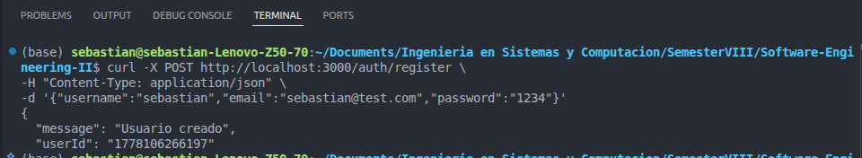

---

### 2. Inicio de sesión (Login)

Se autentica el usuario con las credenciales registradas mediante una petición `POST` al endpoint `/auth/login`.

```bash
curl -X POST http://localhost:3000/auth/login \
-H "Content-Type: application/json" \
-d '{"email":"sebastian@test.com","password":"1234"}'
```

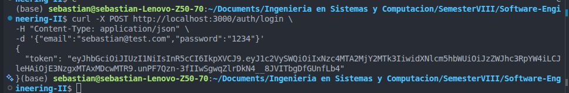

---

### 3. Almacenar el token en una variable

Para facilitar el uso del token JWT en las siguientes peticiones, se almacena directamente en una variable de entorno.

```bash
TOKEN=$(curl -s -X POST http://localhost:3000/auth/login \
-H "Content-Type: application/json" \
-d '{"email":"sebastian@test.com","password":"1234"}' | jq -r '.token')
```

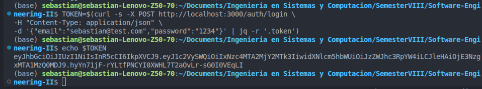

---

### 4. Obtener tareas con token

Se consultan las tareas del usuario autenticado enviando el token en el encabezado `Authorization`.

```bash
curl -X GET http://localhost:3000/tasks \
-H "Authorization: Bearer $TOKEN"
```

> **Nota:** Si se intenta acceder sin token, el servidor responde con error de autenticación.

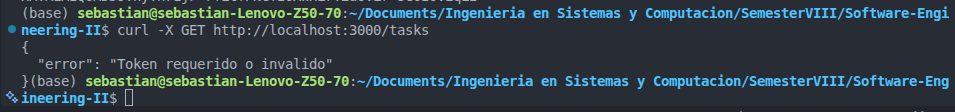

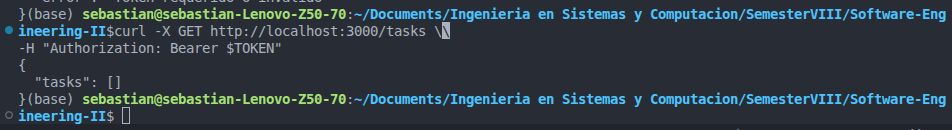

---

### 5. Crear una nueva tarea

Se crea una nueva tarea enviando una petición `POST` al endpoint `/tasks` con el token de autorización.

```bash
curl -X POST http://localhost:3000/tasks \
-H "Content-Type: application/json" \
-H "Authorization: Bearer $TOKEN" \
-d '{"title":"Estudiar JWT","description":"Practicar"}'
```

Luego se verifica que la tarea fue creada consultando nuevamente las tareas:

```bash
curl -X GET http://localhost:3000/tasks \
-H "Authorization: Bearer $TOKEN"
```

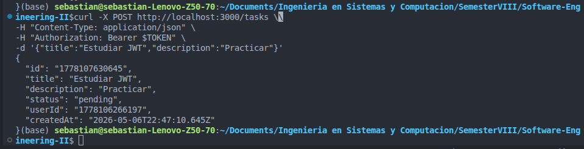

---

### 6. Crear y almacenar una tarea (para pruebas de PUT y DELETE)

Se crea una tarea y se almacena la respuesta en una variable para obtener su `id`.

```bash
TASK=$(curl -s -X POST http://localhost:3000/tasks \
-H "Content-Type: application/json" \
-H "Authorization: Bearer $TOKEN" \
-d '{"title":"Tarea de prueba","description":"Para probar PUT y DELETE"}')
```

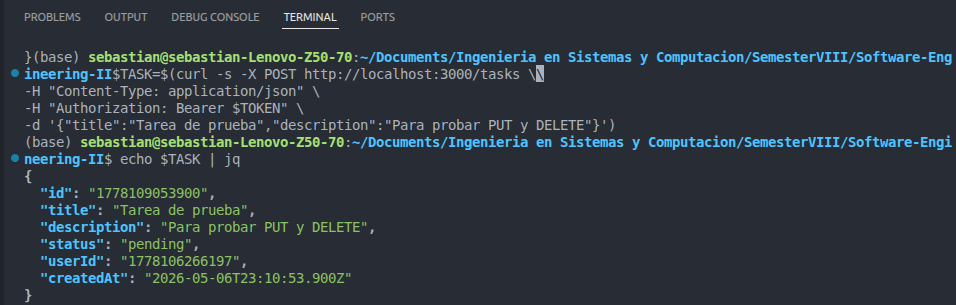

---

### 7. Obtener el ID de la tarea

Se extrae el `id` de la tarea almacenada para usarlo en las siguientes operaciones.

```bash
TASK_ID=$(echo $TASK | jq -r '.id')
echo $TASK_ID
```

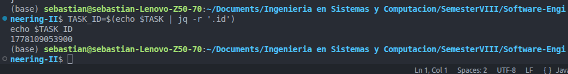

---

### 8. Actualizar una tarea (método PUT)

Se actualiza el estado de la tarea utilizando el método `PUT`.

```bash
curl -X PUT http://localhost:3000/tasks/$TASK_ID \
-H "Content-Type: application/json" \
-H "Authorization: Bearer $TOKEN" \
-d '{"status":"completed"}'
```

#### Implementación del método PUT en el servidor

```javascript
if (method === 'PUT' && url.startsWith('/tasks/')) {
  const usuario = autenticar(req);

  if (!usuario)
    return send(res, 401, { error: 'Token requerido o invalido' });

  const id = url.split('/')[2];

  // Buscar la tarea por id en db.tasks
  const tarea = db.tasks.find(t => t.id === id);

  // Si no existe, retornar 404
  if (!tarea)
    return send(res, 404, { error: 'Tarea no encontrada' });

  // Verificar que task.userId === usuario.userId, si no retornar 403
  if (tarea.userId !== usuario.userId)
    return send(res, 403, {
      error: 'No autorizado para modificar esta tarea'
    });

  // Leer el body y actualizar los campos recibidos (title, description, status)
  const { title, description, status } = await readBody(req);

  if (title) tarea.title = title;
  if (description) tarea.description = description;
  if (status) tarea.status = status;

  // Retornar la tarea actualizada con status 200
  return send(res, 200, tarea);
}
```

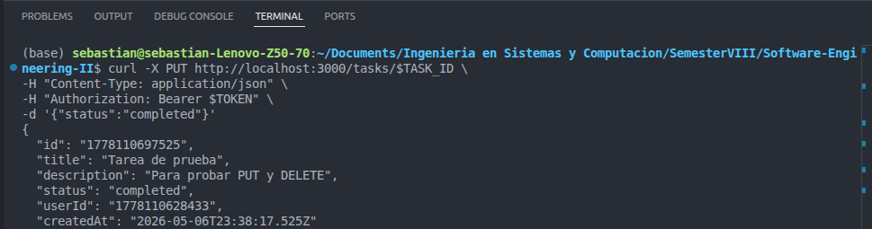

---

### 9. Eliminar una tarea (método DELETE)

Se elimina la tarea utilizando el método `DELETE` con el `id` almacenado.

```bash
curl -X DELETE http://localhost:3000/tasks/$TASK_ID \
-H "Authorization: Bearer $TOKEN"
```

#### Implementación del método DELETE en el servidor

```javascript
if (method === "DELETE" && url.startsWith("/tasks/")) {
  const usuario = autenticar(req);

  if (!usuario)
    return send(res, 401, { error: "Token requerido o invalido" });

  const id = url.split("/")[2];

  // Buscar la tarea por id en db.tasks
  const tarea = db.tasks.find((t) => t.id === id);

  // Si no existe, retornar 404
  if (!tarea) return send(res, 404, { error: "Tarea no encontrada" });

  // Verificar que task.userId === usuario.userId, si no retornar 403
  if (tarea.userId !== usuario.userId)
    return send(res, 403, {
      error: "No autorizado para eliminar esta tarea",
    });

  // Eliminar la tarea del arreglo db.tasks
  db.tasks = db.tasks.filter((t) => t.id !== id);

  // Retornar status 204 sin body
  res.writeHead(204);
  return res.end();
}
```

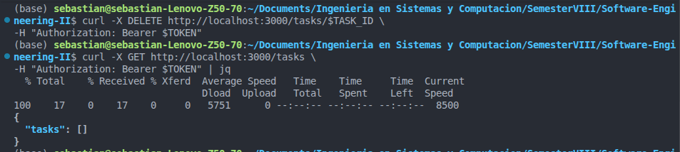

---

## 🖥️ Conexión SSH desde Windows

Se estableció una conexión SSH al servidor Linux desde un sistema operativo Windows, utilizando las siguientes credenciales:

| Parámetro | Valor             |
|-----------|-------------------|
| Usuario   | `sebastian`       |
| IP        | `192.168.100.50`  |

```bash
ssh sebastian@192.168.100.50
```

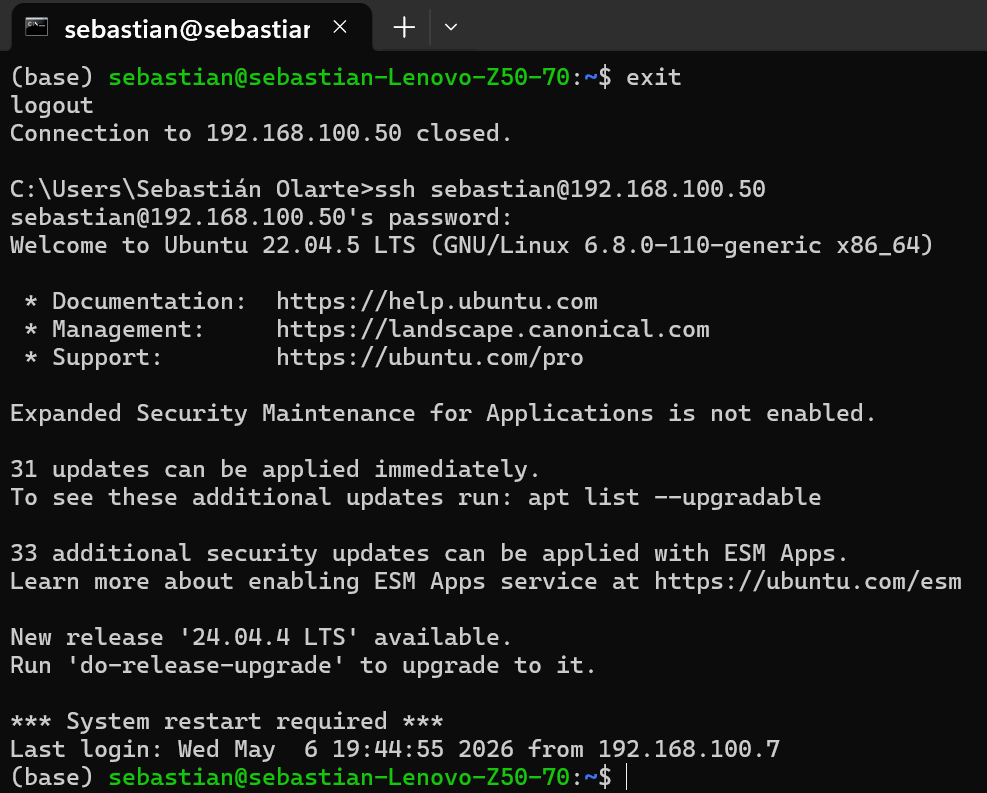

---

### Prueba de endpoints PUT y DELETE desde Windows vía SSH

Una vez establecida la conexión SSH, se probaron los endpoints de actualización y eliminación de tareas directamente desde la terminal de Windows.

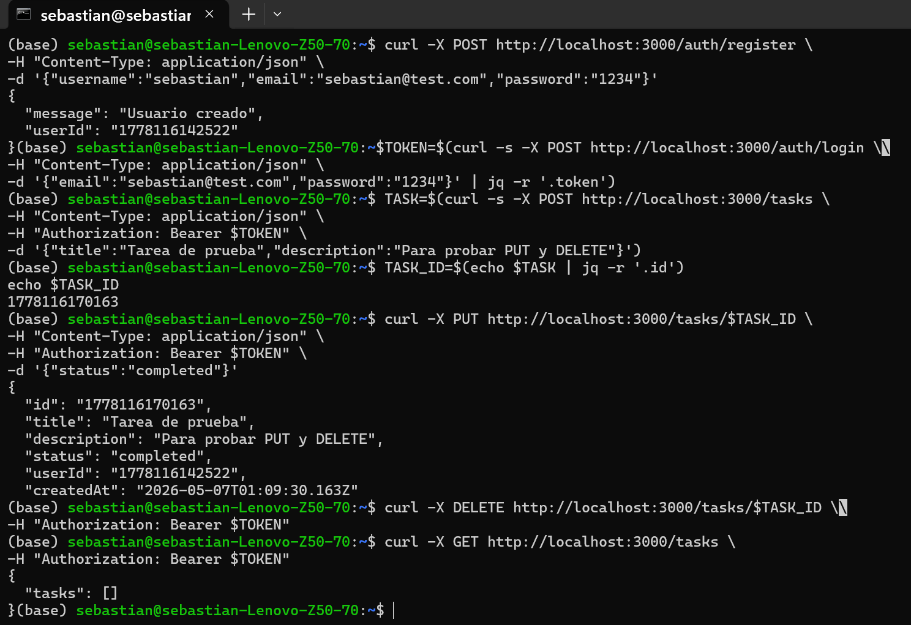

---

## ✅ Conclusión

Se implementó y probó exitosamente un servidor de autenticación con JWT que permite:

- Registro e inicio de sesión de usuarios.
- Protección de rutas mediante tokens JWT.
- Creación, consulta, actualización y eliminación de tareas (CRUD completo).
- Verificación de autorización por propietario de cada tarea.
- Validación de los endpoints desde un sistema operativo Windows mediante conexión SSH.